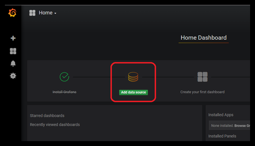
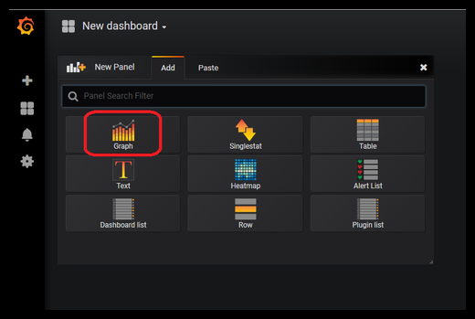
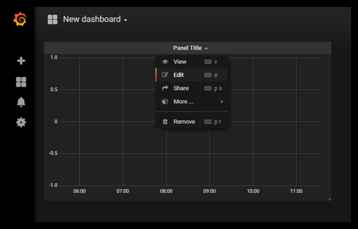
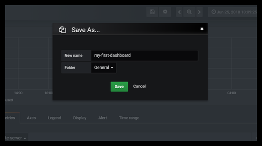

# Basic Monitoring
Lab: Basic monitoring using Grafana, Graphite and Collectd with Docker containers

---

## Setting up the environment


 - Clone the repository to get the docker-compose file

```
$ git clone https://github.com/leonjalfon1/basic-monitoring-lab.git
$ cd basic-monitoring-lab
```
 - Set up the environment by run:

```
$ docker-compose up -d
```

***

## Exploring Grafana


 - Browse to the Grafana portal:

```
$ http://localhost:3000
```

 - Login using the credentials below:

```
username: admin
password: admin
```

 - You will be asked for set a new password, set the password below:

```
password: admin
```

 - Explore Grafana on your own
 
 ***

## Exploring Graphite


 - Browse to the Graphite portal:

```
$ http://localhost:5000
```

 - Login using the credentials below:

```
username: root
password: root
```

 - Explore Graphite on your own
 
 ***

## Exploring the application

 - Browse to the application page:

```
$ http://localhost:80
```

 ***
 
## Configure collectd in the application server

 - Move to the application container terminal:

```
$ docker exec -it app /bin/bash
```

 - Install collectd tool:

```
$ apt-get update
$ apt-get install -y collectd collectd-utils
```

 - Install vim tool:

```
$ apt-get install -y vim
```

 - Configure collectd to send metrics to Graphite:

```
$ vim /etc/collectd/collectd.conf
```

 - Enable the following plugins:

```
LoadPlugin cpu
LoadPlugin df
LoadPlugin interface
LoadPlugin load
LoadPlugin memory
LoadPlugin ping
LoadPlugin write_graphite
```

 - Configure the following plugins as below:

```
<Plugin ping>
        Host graphite
#       Host "host.baz.qux"
        Interval 1.0
        Timeout 0.9
        TTL 255
#       SourceAddress "1.2.3.4"
#       Device "eth0"
        MaxMissed -1
</Plugin>

<Plugin write_graphite>
        <Node "graphite">
                Host graphite
                Port "2003"
                Protocol "tcp"
                LogSendErrors true
#                Prefix "collectd"
#               Postfix "collectd"
                StoreRates true
                AlwaysAppendDS false
                EscapeCharacter "_"
        </Node>
</Plugin>
```

 - For changes to take affect, please restart collectd service :

```
$ /etc/init.d/collectd restart
```

 - Browse to Graphite and look for the new metrics (under <container-id>:

```
$ http://localhost:5000/
```

***

## Add a Data Source and Create a Grafana Dashboard

 - Click Create data source in the main dashboard:


 
 - Fill the form as follows:
 
```
Name: my-graphite-server
Type: Graphite
URL: http://graphite:8080
Access: Server (Default)
Version: <Select the newest available>
```


 - Click New dashboard to create and customize a new panel:


 - Select "Graph":



 - Edit the graph by click "Edit":



 - Configure the "General" section with the below:


 - Configure the "Metrics" section with the below:


 - Configure the "Axes" section with the below:


 - Save the dashboard:


 - You will be asked for the dashboard name and folder, set the following:

```
New name: my-first-dashboard
Folder: General
```



 - Good Job! You already know all the basics to start monitoring, now it only remains to explore on your own :)
 
 
 
